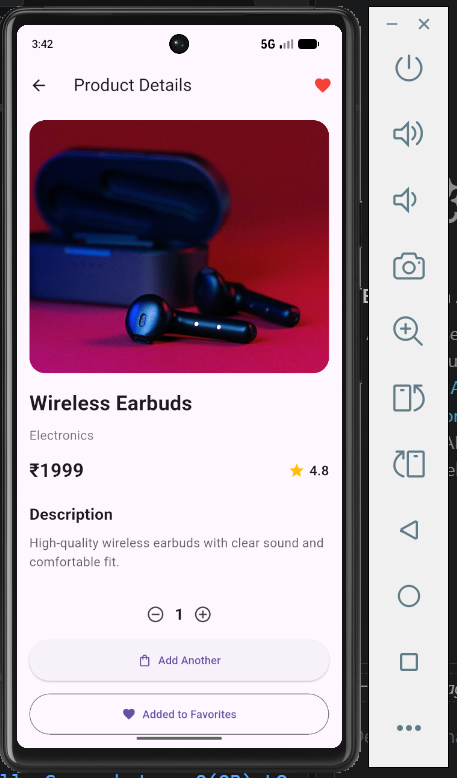
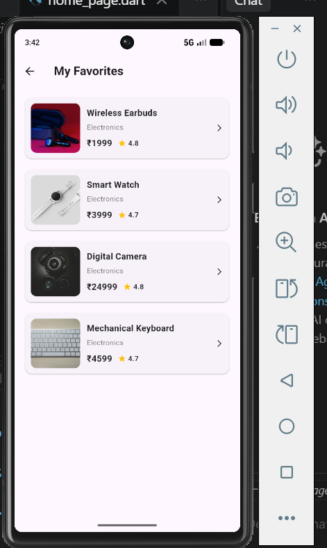
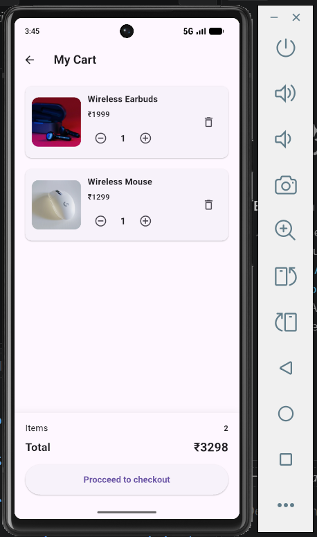

# Product Explorer

A Flutter product exploration application built using **Clean Architecture** and **Provider** for state management.

## Features

* Product listing
* Product details
* Product search
* Category filtering
* Featured products
* Lazy loading / pagination
* Favorite products
* Cart functionality
* Responsive UI
* Error handling

## Technologies Used

* Flutter
* Dart
* Provider
* Clean Architecture
* Material 3

## Project Structure

The project follows a Clean Architecture approach:

```text
lib/
├── data/
│   ├── datasources/
│   └── repositories/
│
├── domain/
│   ├── entities/
│   ├── repositories/
│   └── usecases/
│
└── presentation/
    ├── pages/
    ├── providers/
    └── widgets/
```

### Data Layer

The Data layer contains the local product data source and repository implementation.

The data source provides the product data, while the repository implementation connects the data layer with the Domain layer.

### Domain Layer

The Domain layer contains the application's core business logic.

It includes:

* Product entity
* Product repository contract
* Get Products use case

This layer is independent of the UI.

### Presentation Layer

The Presentation layer contains the application's user interface and state management.

It includes:

* Pages
* Providers
* Reusable widgets

## Provider State Management

The application uses **Provider** with `ChangeNotifier` for state management.

`ProductProvider` manages:

* Product loading
* Search
* Category selection
* Visible products
* Lazy loading
* Favorite products
* Loading states
* Error states

The UI listens to changes from `ProductProvider` using `Consumer` and calls provider methods when the user interacts with the application.

## Lazy Loading

The product list uses lazy loading through pagination.

Initially, only a limited number of products are displayed.

When the user scrolls near the bottom of the product list, `loadMoreProducts()` is called.

The provider increases the number of visible products and displays the next batch.

The provider also prevents multiple loading operations from running at the same time.

## Search and Category Filtering

Users can search for products using the search bar.

Products can also be filtered by category.

When the search text or selected category changes, the provider reapplies the filters and displays the matching products.

## Favorites

Users can add or remove products from their favorites.

Favorite state is managed by `ProductProvider`.

The Favorites page displays the products currently marked as favorites.

## Cart

Users can add products to the cart and manage quantities.

The cart supports:

* Adding products
* Increasing quantity
* Decreasing quantity
* Removing products
* Calculating the total price

## Error Handling

The application handles product-loading errors through the provider.

Product images also provide a fallback UI when an image cannot be loaded.

## Setup and Run

### 1. Clone the repository

```bash
git clone YOUR_GITHUB_REPOSITORY_URL
```

### 2. Open the project

```bash
cd task
```

### 3. Install dependencies

```bash
flutter pub get
```

### 4. Run the application

For Chrome:

```bash
flutter run -d chrome
```

For Android:

```bash
flutter run
```

## Screenshots

### Home Page


### Product Details



### Favorites



### Cart



### Product Details

*Add your Product Details screenshot here.*

### Favorites

*Add your Favorites screenshot here.*

### Cart

*Add your Cart screenshot here.*

## Evaluation Areas

This project focuses on:

* Flutter fundamentals
* Code readability
* Clean Architecture
* Provider state management
* Lazy loading
* Search and category filtering
* Reusable widgets
* Responsive UI

## Author

**Munawir**

Flutter Developer
